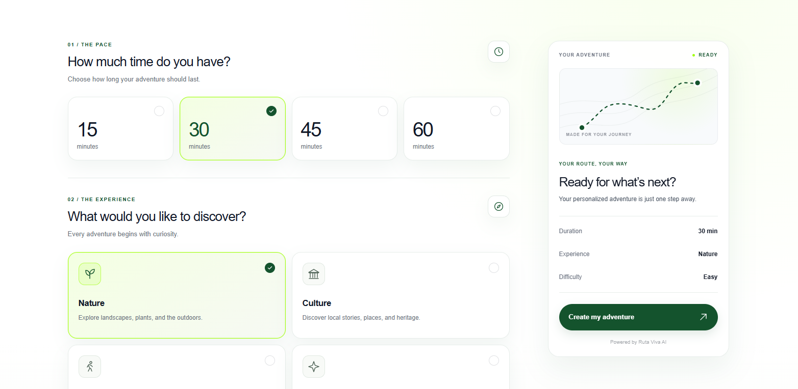
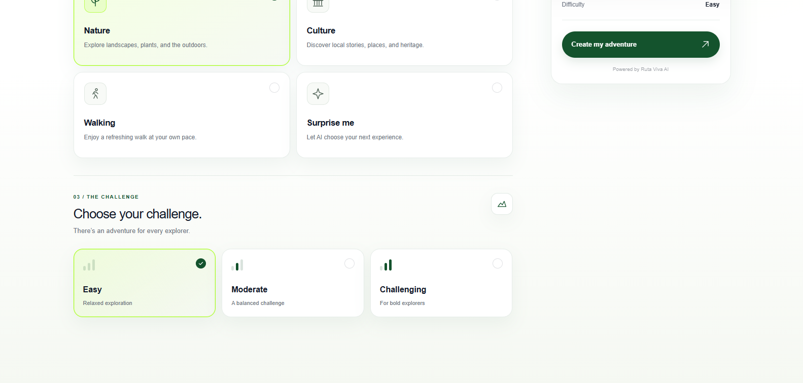
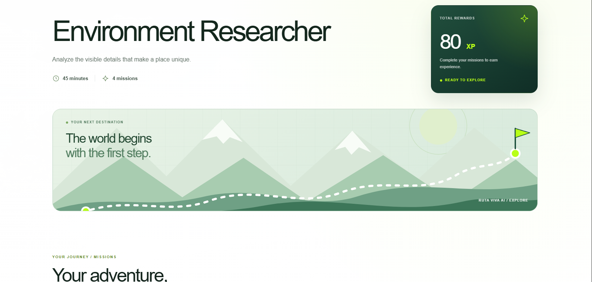
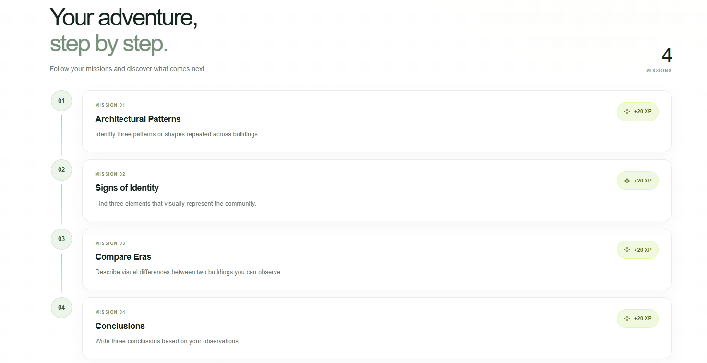
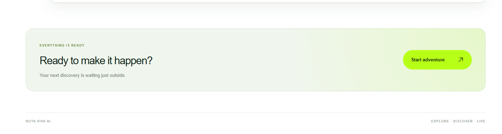
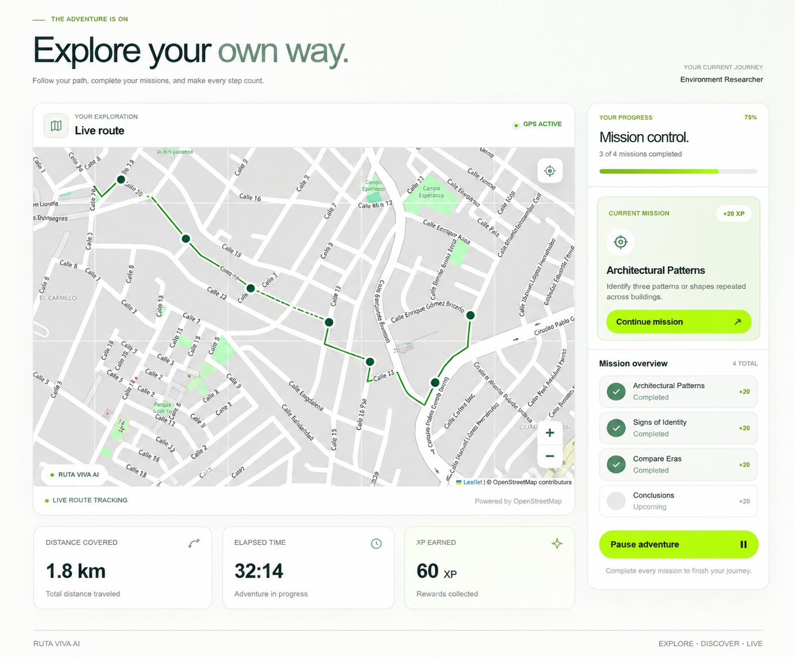
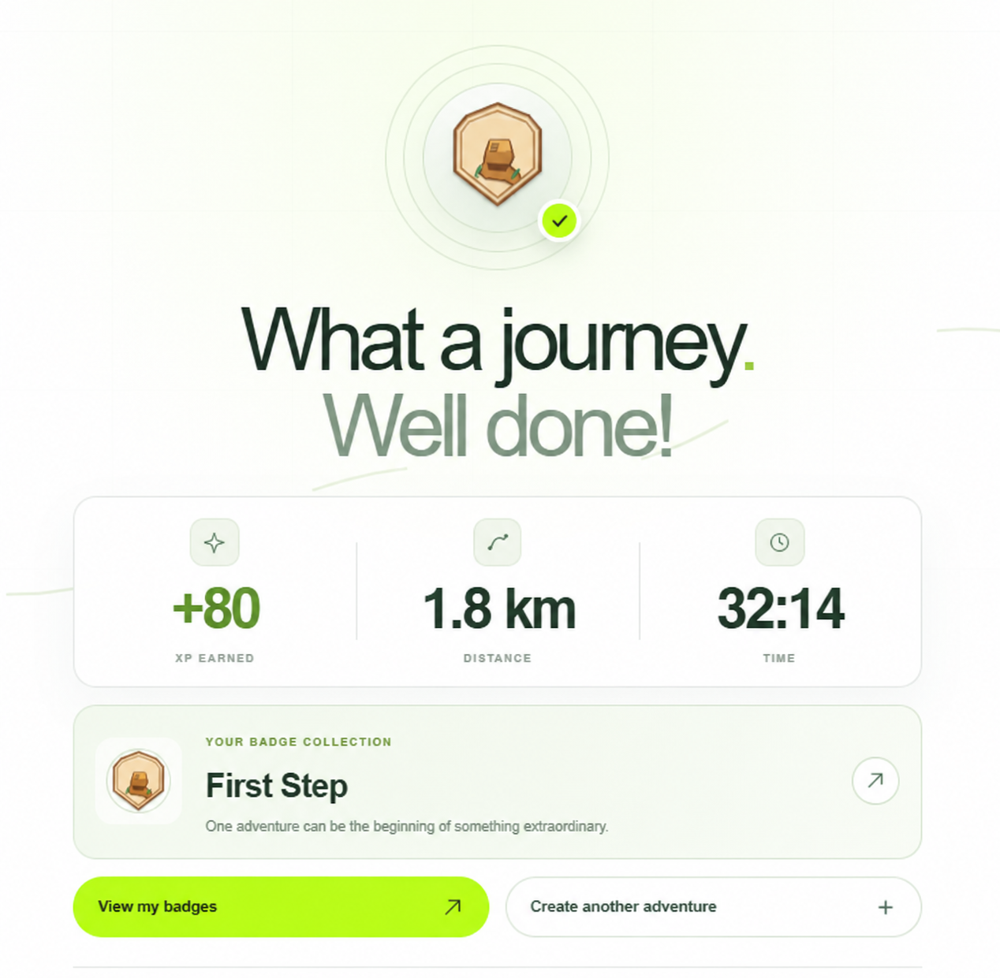
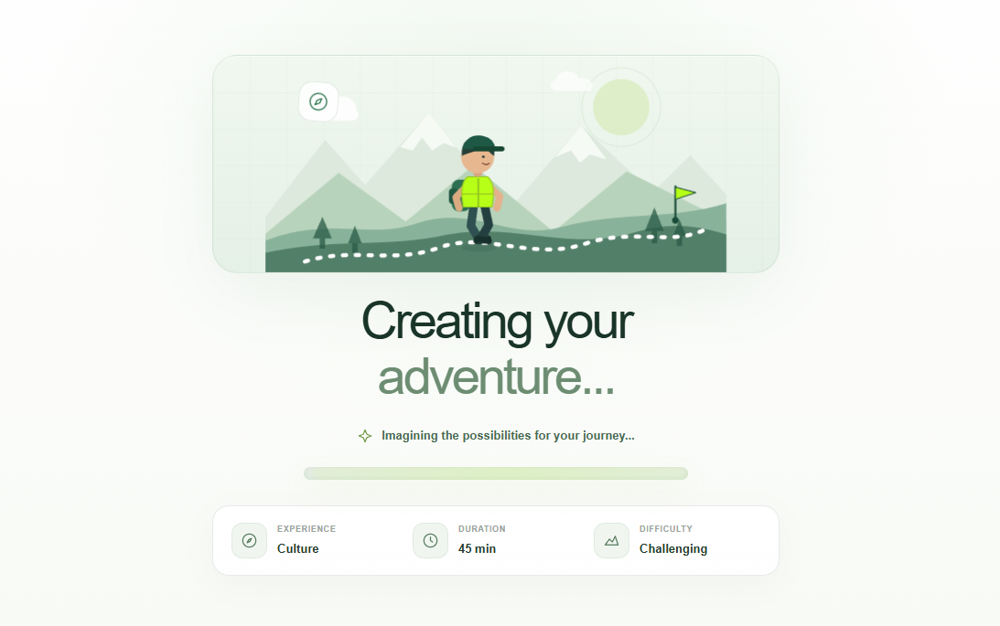
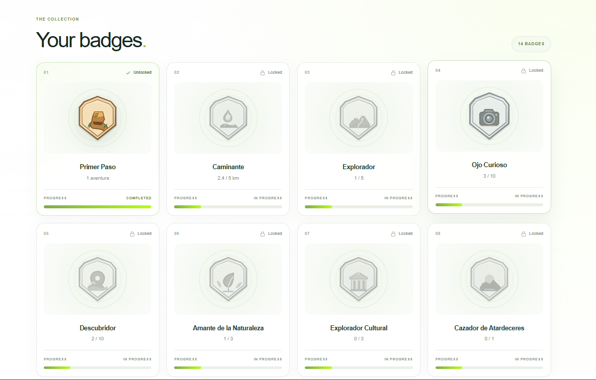
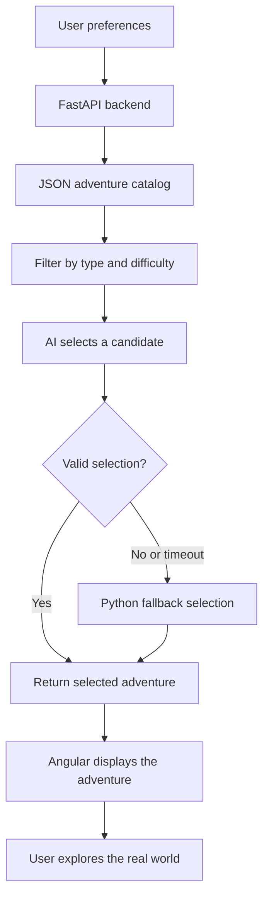

# 🌿 Ruta Viva AI

### Turn the ordinary into an unforgettable adventure.

**Ruta Viva AI** is an AI-powered outdoor adventure platform that transforms everyday walks into interactive missions. Discover your surroundings, complete real-world challenges, earn XP, and explore the world beyond your screen.

Built for the **Hacktoberfest Open-Source AI Challenge — Week 1: Touch Grass**.

<p align="center">
  <a href="https://ruta-viva-ai-hbdn.vercel.app/">
    
  </a>
</p>

<p align="center">
  <a href="https://ruta-viva-ai-hbdn.vercel.app/">
    
  </a>
  
  
</p>

<p align="center">
  <a href="https://ruta-viva-ai-hbdn.vercel.app/">Live Demo</a> ·
  <a href="https://github.com/Ezequie1Sc/ruta-viva-ai">Source Code</a> ·
  <a href="https://ruta-viva-ai-backend.onrender.com/docs">API Documentation</a>
</p>

---

## 🌎 The Idea

We spend so much time looking at screens that we sometimes forget to explore the world around us.

Ruta Viva AI turns going outside into a small adventure. Instead of endlessly scrolling, users receive missions that encourage them to walk, observe nature, discover local culture, and pay attention to the places they visit.

The goal is simple:

**Make the screen the shortest part of the adventure.**

## ✨ Features

- **🤖 AI-Powered Adventure Selection** — AI interprets adventure preferences and selects a suitable adventure from a structured catalog.
- **🗺️ Outdoor Missions** — Complete real-world challenges focused on walking, observation, nature, and culture.
- **🎯 Personalized Preferences** — Choose an adventure type, difficulty level, and duration.
- **⭐ XP and Rewards** — Earn experience points by completing missions.
- **🌳 Nature Exploration** — Discover colors, shapes, sounds, patterns, and other details in your surroundings.
- **🏛️ Cultural Discovery** — Observe architecture, public art, and the character of your community.
- **⚡ JSON Adventure Catalog** — Reuse predefined adventures instead of generating every mission from scratch.
- **🛡️ Fallback Selection** — If the AI provider fails or times out, the backend can select a compatible adventure locally.
- **📱 Responsive Interface** — Explore adventures from desktop or mobile devices.

## 📸 Explore the Experience

### Create your adventure

<p align="center">
  
  
</p>

Choose your preferred adventure type, difficulty, and duration to find an experience that fits your plans.

### Discover your missions

<p align="center">
  
  
</p>

<p align="center">
  
</p>

Every adventure contains a set of missions designed to encourage real-world exploration.

### Explore and track your journey

<p align="center">
  
</p>

Turn a regular walk into an opportunity to discover something new.

### Celebrate your progress

<p align="center">
  
</p>

Complete your missions, collect XP, and celebrate the experience.

### Additional interface screens

<p align="center">
  
  
</p>

## 🧠 How the AI Works

Ruta Viva AI uses a hybrid architecture that combines AI-assisted selection with a structured JSON adventure catalog.

Instead of asking a language model to generate every mission from scratch, the application provides a set of predefined adventures and lets the AI choose the most appropriate option.



### Why this architecture?

- **Less generation work:** the model selects existing content rather than writing every mission from scratch.
- **Structured output:** predefined missions, XP values, and adventure metadata make responses more consistent.
- **Graceful degradation:** Python can provide an alternative when the AI provider is unavailable.
- **Flexible catalog:** new adventures can be added without rewriting the selection logic.

The AI remains part of the decision-making process, while the catalog provides a reliable source of adventure content.

## 🌱 Why Open Innovation Matters

Open innovation makes it possible to experiment with AI systems, change models, inspect application logic, and build tools around individual needs.

For Ruta Viva AI, a model-based selection layer separates the adventure experience from the content catalog. This makes the project easier to extend, evaluate, and adapt to different AI providers and models.

The project uses an OpenRouter-compatible model configuration, allowing the model to be changed through backend configuration rather than hardcoding a specific model into the application.

The current implementation uses hosted inference, so it requires an internet connection and depends on the availability and limits of the configured provider. Local, offline inference is not currently implemented.

The broader goal is to keep the application adaptable: the AI model can evolve without requiring a complete redesign of the adventure system.

## 🛠️ Tech Stack

| Technology | Purpose |
|---|---|
| Angular | Responsive frontend application |
| TypeScript | Frontend logic and type safety |
| SCSS / CSS | Interface styling |
| Python | Backend logic |
| FastAPI | REST API and request validation |
| Pydantic | Data models and response validation |
| HTTPX | Asynchronous HTTP requests to the AI provider |
| OpenRouter | Access to the configured AI model |
| JSON | Structured adventure catalog |
| Vercel | Frontend deployment |
| Render | Backend deployment |

## 🏗️ Project Architecture

```text
ruta-viva-ai/
├── backend/
│   ├── app/
│   │   ├── api/
│   │   │   └── adventures.py
│   │   ├── core/
│   │   │   └── config.py
│   │   ├── data/
│   │   │   └── adventures.json
│   │   ├── models/
│   │   │   └── adventure.py
│   │   ├── services/
│   │   │   ├── ai_service.py
│   │   │   └── catalog_service.py
│   │   └── main.py
│   └── requirements.txt
│
├── frontend/
│   ├── public/
│   │   ├── adventure/
│   │   ├── badge/
│   │   ├── create/
│   │   ├── exploration/
│   │   ├── hero/
│   │   ├── loading/
│   │   └── result/
│   └── src/
│
└── README.md
```

## 🚀 Getting Started

### Prerequisites

- Python 3.11 or a compatible Python version supported by your dependencies.
- Node.js and pnpm.
- An OpenRouter API key.
- Git.

### 1. Clone the repository

```bash
git clone https://github.com/Ezequie1Sc/ruta-viva-ai.git
cd ruta-viva-ai
```

### 2. Configure the backend

```bash
cd backend
python -m venv .venv
```

Activate the virtual environment.

**Windows PowerShell**

```powershell
.\.venv\Scripts\Activate.ps1
```

**macOS / Linux**

```bash
source .venv/bin/activate
```

Install the dependencies:

```bash
python -m pip install -r requirements.txt
```

### 3. Configure environment variables

Create a `.env` file inside `backend/`:

```env
OPENROUTER_API_KEY=your_openrouter_api_key
OPENROUTER_MODEL=your_supported_model_id
```

Use a model ID supported by OpenRouter and compatible with the application's selection prompt.

Never commit your actual API key to GitHub.

### 4. Run the backend

From the `backend/` directory:

```bash
python -m uvicorn app.main:app --reload
```

The API will be available at:

- API: `http://127.0.0.1:8000/`
- Health check: `http://127.0.0.1:8000/health`
- Interactive documentation: `http://127.0.0.1:8000/docs`

### 5. Run the frontend

Open a second terminal:

```bash
cd frontend
pnpm install
pnpm start
```

If your `package.json` does not define a `start` script, run Angular directly:

```bash
pnpm exec ng serve
```

Open `http://localhost:4200/` in your browser.

## 🔌 API Reference

### Generate an adventure

**Endpoint**

```http
POST /api/adventures/generate
```

**Request body**

```json
{
  "duration": 30,
  "adventure_type": "nature",
  "difficulty": "easy"
}
```

Supported adventure types:

- `nature`
- `culture`
- `walk`
- `surprise`

Supported difficulty levels:

- `easy`
- `medium`
- `hard`

**Example response**

```json
{
  "title": "Cazadores de hojas",
  "description": "Explora las formas y texturas de la vegetación sin alterar el entorno.",
  "duration": 30,
  "missions": [
    {
      "title": "Hojas diferentes",
      "description": "Observa tres hojas de formas distintas sin arrancarlas.",
      "xp": 15
    },
    {
      "title": "Busca sombras",
      "description": "Encuentra dos sombras interesantes creadas por la vegetación.",
      "xp": 10
    },
    {
      "title": "Detecta simetría",
      "description": "Encuentra una forma simétrica en la naturaleza.",
      "xp": 15
    }
  ],
  "total_xp": 40
}
```

### Health check

```http
GET /health
```

Returns the backend service status.

## 🛡️ Safety First

Ruta Viva AI encourages exploration without putting users at unnecessary risk.

Missions should:

- Use public and accessible spaces.
- Avoid dangerous roads and restricted areas.
- Encourage observation rather than touching unknown objects or wildlife.
- Never require purchases or special equipment.
- Respect the privacy of other people and the environment.

Stay aware of your surroundings and do not use your phone while crossing streets or navigating hazardous areas.

## 🔮 Future Improvements

- GPS-based mission progress and route tracking.
- More diverse adventure categories and a larger curated catalog.
- Duration-aware adventure selection.
- Improved response-time monitoring and caching.
- Additional open-weight model options.
- Optional local inference for supported devices.
- More achievement badges and progression mechanics.
- User-submitted adventures and community contributions.

## 🏆 Hacktoberfest Open-Source AI Challenge

**Challenge:** [Hacktoberfest Open-Source AI Challenge — Week 1: Touch Grass](https://dev.to/challenges/hacktoberfest-week1-2026-10-05)

**Theme:** Build something with open-weight models or open-source AI that encourages people to spend more time outside.

Ruta Viva AI addresses this challenge by using AI-assisted adventure selection to turn everyday outdoor activities into structured, game-like experiences.

The project aims to make exploration more engaging while keeping the content system flexible and the experience focused on the real world.

**Built for the challenge. Designed for the outdoors.**

## 🤝 Contributing

Contributions, suggestions, bug reports, and new adventure ideas are welcome.

1. Fork the repository.
2. Create a feature branch.
3. Make your changes.
4. Test the frontend or backend affected by your changes.
5. Open a pull request describing your contribution.

Please avoid committing secrets, API keys, virtual environments, or generated build artifacts.

## 📄 License

No license has been specified in this README. Add an appropriate `LICENSE` file before describing the repository as open source under a particular license.

## 🌿 Get Outside

Ready to turn an ordinary walk into an adventure?

<p align="center">
  <a href="https://ruta-viva-ai-hbdn.vercel.app/">
    
  </a>
</p>

<p align="center">
  Made with curiosity, code, and a little help from AI. 🌱
</p>
